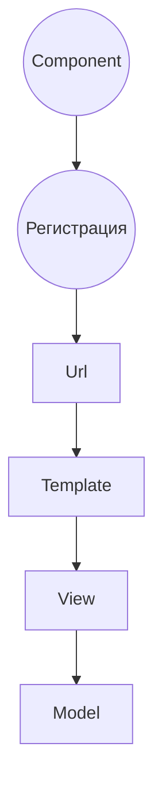
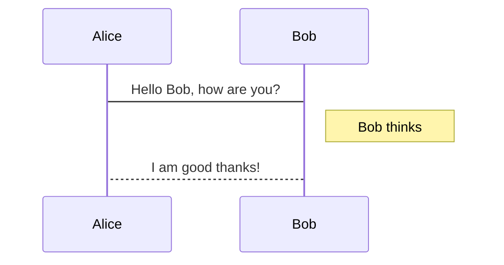

# kmi-mat-el

```mermaid
graph TD;


    A((Component))-->B((Регистрация));
    


    B-->C[Url]
    
    
    
    
    
    
    C-->D[Template]
    
    


    D-->E[View]
    
    
    
        
    E-->F[Model]
    
    
    
```

```mermaid
%% Example of sequence diagram
sequenceDiagram
Alice->Bob: Hello Bob, how are you?
Note right of Bob: Bob thinks
Bob-->Alice: I am good thanks!
```